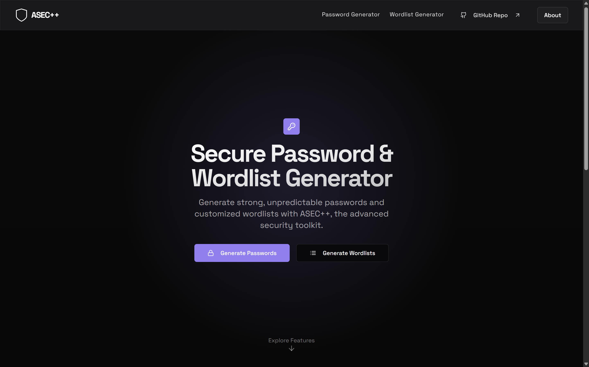
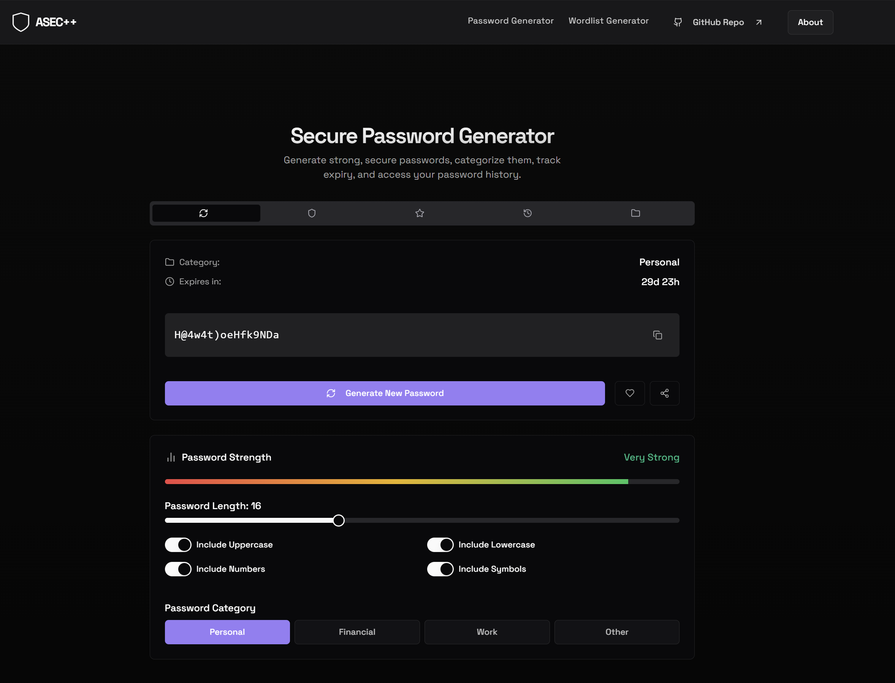
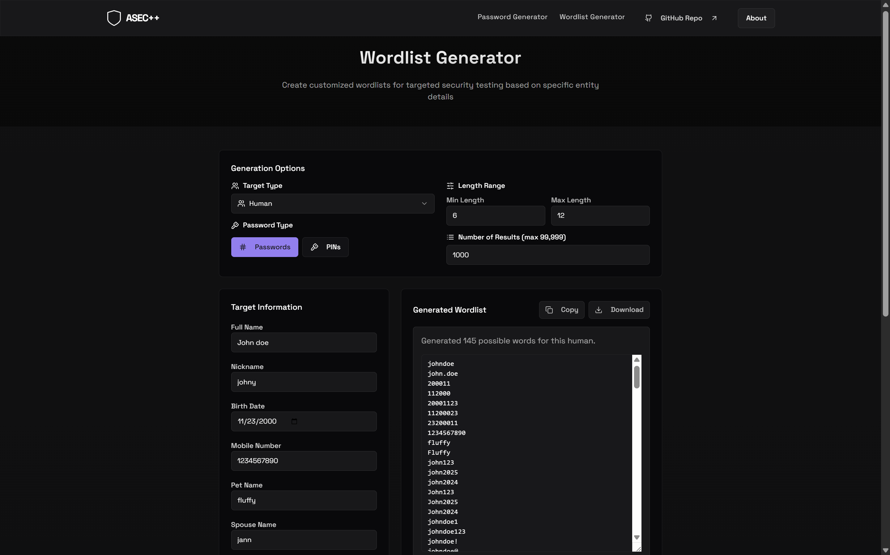
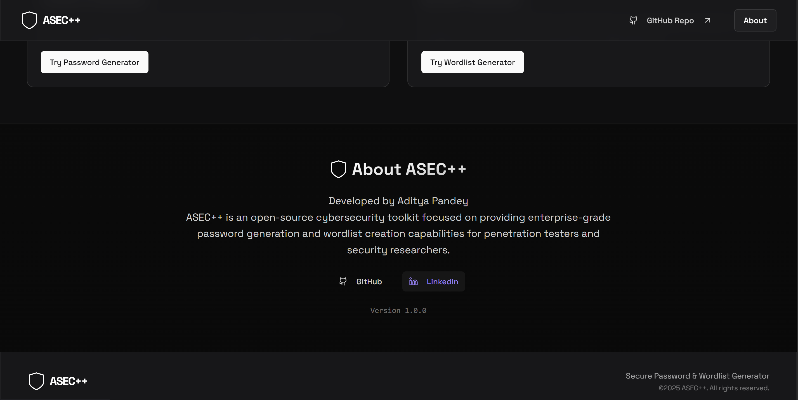

<div align="center">
  
  <h1>ASEC++</h1>
  <h2><strong>Secure Password & Wordlist Generator</strong></h2>

  [](https://reactjs.org/)
  [](https://www.typescriptlang.org/)
  [](https://asecplus.vercel.app)
</div>

## About the Project

ASEC++ is an advanced cybersecurity toolkit focused on providing enterprise-grade password generation and wordlist creation capabilities for penetration testers and security researchers. Built with React and TypeScript, it offers a modern interface with comprehensive security features and real-time password strength analysis.

**[🔗Try the Live Demo →](https://asecplus.vercel.app/)**

## Features

- 🔐 **Password Generator**
  - Cryptographically secure random password generation
  - Multiple character sets for enhanced complexity
  - Real-time password strength assessment
  - Password categorization (Personal, Financial, Work, Other)
  - Password expiration tracking
  - Password history management
  - Favorites system for frequently used passwords

- 🔍 **Password Security Tools**
  - Comprehensive password strength analyzer
  - Data breach checker
  - Smart password suggestions
  - Character variety assessment
  - Common pattern detection
  - Detailed security recommendations

- 📝 **Wordlist Generator**
  - Create customized wordlists for targeted security testing
  - Based on specific entity details
  - Tailored for penetration testing scenarios
  - Security assessment optimization

- 🎨 **Modern Interface**
  - Clean, intuitive dark-themed UI
  - Glass morphism design elements
  - Responsive layout for all devices
  - Smooth animations and transitions

- ⚙️ **Customization Options**
  - Password length (8-32 characters)
  - Character type selection
    - Uppercase letters (A-Z)
    - Lowercase letters (a-z)
    - Numbers (0-9)
    - Special characters (!@#$%^&*)
  - Password categorization
  - Password sharing capabilities

## 📸 Screenshots

<div align="center">


### Home Screen


### Password Generator


### Wordlist Generator


### About Section


</div>


## 🧪 Usage Guide

### 1️⃣ Password Generator
- Choose length and character types
- Select password category
- Click "Generate New Password"
- Copy or save to favorites

### 2️⃣ Password Checker
- Analyze generated password
- Check for breaches
- Get strength score & feedback
- Apply suggested improvements

### 3️⃣ Wordlist Generator
- Enter entity details
- Customize wordlist settings
- Generate & export

## 🛠️ Tech Stack

| Tech         | Description                          |
|--------------|--------------------------------------|
| React + TS   | Modern frontend framework            |
| Tailwind CSS | Utility-first responsive styling     |
| shadcn/ui    | Custom UI component library          |
| Framer Motion| Animations and transitions           |
| Vite         | Fast development build tool          |


## Contributing

We welcome contributions! Here's how you can help:

1. **Fork the Repository**
   ```bash
   git clone https://github.com/ADP-1/ASEC.git
   ```

2. **Create a New Branch**
   ```bash
   git checkout -b feature/your-feature-name
   ```

3. **Make Changes and Commit**
 -  Write clean, documented code
 - Follow existing code style
 - Add tests if applicable

   ```bash
   git add .
   git commit -m "Add your commit message here"
   ```

4. **Push Changes to Your Fork**
   ```bash
   git push origin feature/your-feature-name
   ```

5. **Create a Pull Request**
   - Go to the original repository
   - Click "New Pull Request"
   - Select your branch and base branch
   - Describe your changes and submit the PR

---

<div align="center">

## ⭐ Show Some Love

If you like this project, consider giving it a ⭐ on 
<a href="https://github.com/ADP-1/ASEC">GitHub</a>!  
It helps support the project and keeps us going.

</div>

---
